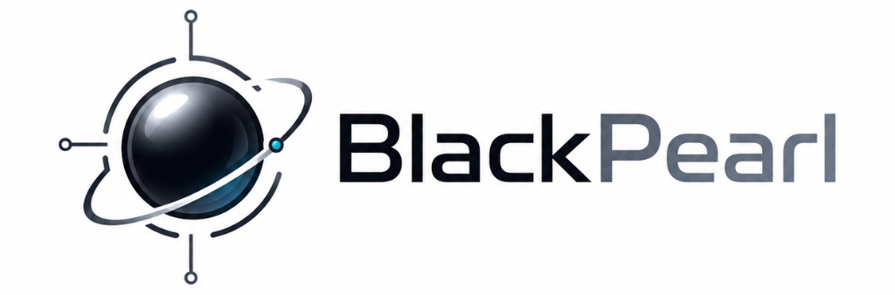

<p align="center">
  
</p>

# 📜 SUper Suite — Official Manifesto & Ecosystem Declaration

> **Unified Autonomous AI Engineering Operating System**  
> *Curated, standardized, and orchestrated by Arif (`modarif`).*

---

## 🌍 Preamble: Why SUper Suite Exists

In the rapidly evolving landscape of AI-assisted software development, the developer community faced extreme fragmentation:
- Breakthrough agent harnesses were isolated in standalone repositories.
- World-class coding skills and engineering rules were locked to specific CLI tools.
- Industry-specialized personas (from AppSec to Healthcare and GIS) were scattered across disparate prompts and platforms.
- Setting up a complete, battle-tested AI engineering environment on a new machine required dozens of manual configurations, risk of broken paths, and lost workflow context.

**SUper Suite** was conceived and built to solve this challenge once and for all: **a single, unified, production-grade monorepo that synthesizes the absolute highest-quality AI agents, engineering standards, execution isolation engines, and specialized skills from across the global ecosystem into one cohesive, portable operating system.**

---

## 🏛️ The Four Foundational Pillars

SUper Suite curates, harmonizes, and extends breakthrough innovations from top open-source AI engineering platforms:

```
                                 ┌─────────────────────────────────────────┐
                                 │           SUPER SUITE ECOSYSTEM         │
                                 └────────────────────┬────────────────────┘
                                                      │
         ┌───────────────────────────┬────────────────┴───────────────────────────┬───────────────────────────┐
         ▼                           ▼                                            ▼                           ▼
┌──────────────────┐       ┌──────────────────┐                         ┌──────────────────┐       ┌──────────────────┐
│SUPER ORCHESTRATOR│       │   SUPER CORE     │                         │   SUPER SKILLS   │       │ SUPER DIVISIONS  │
│(Lead Supervisor) │       │(Execution Engine)│                         │ (Skills & Rules) │       │ (18 Specialists) │
└────────┬─────────┘       └────────┬─────────┘                         └────────┬─────────┘       └────────┬─────────┘
         │                          │                                            │                          │
┌────────┴─────────┐       ┌────────┴─────────┐                         ┌────────┴─────────┐       ┌────────┴─────────┐
│ Antigravity IDE  │       │ DeepSeek Harness │                         │ Everything Claude│       │    The Agency    │
│  & Gemini CLI    │       │ (Cordis Engine)  │                         │    Code (ECC)    │       │ (273+ Personas)  │
└──────────────────┘       └──────────────────┘                         └──────────────────┘       └──────────────────┘
```

### 1. 🎯 SUper Orchestrator (Lead Supervisor Layer)
- **Origin & Heritage**: Built upon the architecture of **Antigravity Lead Orchestrator** and **Google Gemini CLI Global Configuration**.
- **Role**: Serves as the top-level supervisor for task decomposition, risk-based routing, evidence verification, and intent-driven skill auto-activation across 345+ capabilities.

### 2. ⚡ SUper Core (Execution & Isolation Engine)
- **Origin & Heritage**: Built upon the multi-process worktree isolation design of **DeepSeek Harness** (`dsh`) and the **Cordis** composable plugin paradigm.
- **Role**: Provides process-isolated Git worktrees (`.worktrees/dsh-*`), automated 26-pipeline team execution (`dsh-team.js`), and pure base snapshot diffing (`RESULT - BASE SNAPSHOT`) to guarantee host repository integrity.

### 3. 🛠️ SUper Skills (Engineering Workflows & Rules)
- **Origin & Heritage**: Built upon the battle-tested engineering skills and workflow standards of **Everything Claude Code (ECC)**.
- **Role**: Equips agents with 68 specialized subagents, 286+ engineering workflows, TDD discipline (80%+ target coverage), and shared MCP connectors across all major programming stacks.

### 4. 🎭 SUper Divisions (18 Enterprise Specialist Domains)
- **Origin & Heritage**: Curated from the comprehensive 273+ subagent persona library of **The Agency**.
- **Role**: Delivers specialized intelligence across 18 real-world divisions (Engineering, Security/AppSec, Skeptical QA, Design Systems, Product Management, Healthcare, Finance, GIS/Spatial, Game Dev, Paid Media, and Specialized tools).

---

## 🔒 Unified Value-Add & Standardization

SUper Suite is **not merely a collection of files** — it introduces crucial architectural glue and engineering discipline:

1. **Universal Hard Rules**:
   - **5-Level Modular Decomposition**: `Project → Module → Feature → Use-case → Responsibility → File` (strictly enforced across all roles).
   - **Documentation-First & Sequential Execution**: Mandatory live-code reality checks before writing code, executing exactly one active micro-task at a time.
2. **Dynamic Universal Persona Loader**:
   - Bridges SUper Divisions directly into SUper Core execution scripts (`getAgencyPrompt()`), allowing any specialist persona to run inside isolated worktrees.
3. **Zero-Configuration 1-Click Portability**:
   - Standalone `install.ps1` (Windows) and `install.sh` (Linux/macOS) deploy the entire 345+ skill pool and 273+ subagent roster to a brand new machine in under 30 seconds.
4. **Universal Scaffolder (`scaffold.ps1`)**:
   - Instantly injects SUper Suite rules, prompts, and guidelines into any new or existing software repository.

---

## ⚖️ Open Source Attribution & Licensing

SUper Suite respects, honors, and builds upon the open-source community:
- All underlying foundational components are licensed under permissive open-source licenses (**MIT License**).
- Transparent attribution is preserved across all respective component directories in `frameworks/` and `platforms/`.
- This monorepo is maintained as an open-source contribution to empower developers and autonomous AI engineering teams worldwide.

---

**Crafted with precision for the future of Autonomous AI Engineering.**  
*Official Repository: [https://github.com/modarif/SUper](https://github.com/modarif/SUper)*


