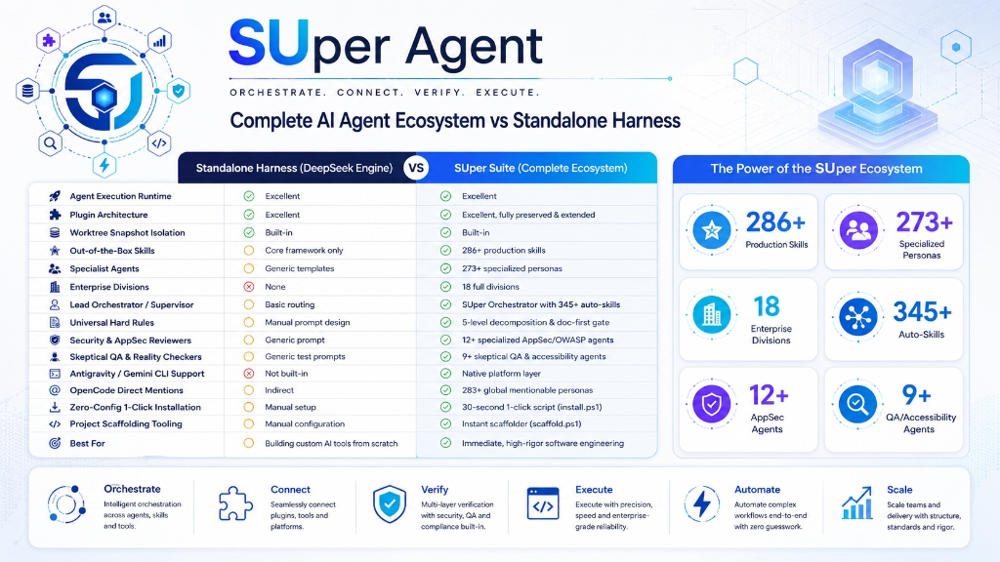

<p align="center">
  
</p>
# 💻 Complete New PC / Fresh Windows Setup Guide for BlackPearl

This guide provides step-by-step instructions for getting your complete AI engineering ecosystem running on a fresh PC or after reinstalling Windows.

<p align="center">
  
</p>

---

## 📋 Prerequisites

Before installing, ensure you have:
1. **Git**: [https://git-scm.com/downloads](https://git-scm.com/downloads)
2. **Node.js (v18+)**: [https://nodejs.org/](https://nodejs.org/)
3. **PowerShell 5.1 or 7+** (built into Windows) or **Bash** (Linux/macOS/WSL)

---

## 📥 Step 1: Clone BlackPearl

Clone the master repository to your preferred tools folder (e.g. `G:\0000 PY PROGRAM\_AI_TOOLS\BlackPearl` or `C:\AI_TOOLS\BlackPearl`):

```powershell
git clone https://github.com/BlackPearl-AI/BlackPearl.git "G:\0000 PY PROGRAM\_AI_TOOLS\BlackPearl"
cd "G:\0000 PY PROGRAM\_AI_TOOLS\BlackPearl"
```

*Or on Linux / macOS / WSL:*
```bash
git clone https://github.com/BlackPearl-AI/BlackPearl.git ~/BlackPearl
cd ~/BlackPearl
```

---

## ⚡ Step 2: Run the One-Click Master Installer

Run the PowerShell installer script:

```powershell
Set-ExecutionPolicy -Scope Process -ExecutionPolicy Bypass
.\install.ps1
```

*Or on Linux / macOS / WSL:*
```bash
chmod +x install.sh
./install.sh
```

### What `install.ps1` does automatically:
1. **BlackPearl Orchestrator (Lead Supervisor)**:
   - Creates `~/.gemini/config/`
   - Deploys `AGENTS.md` and `GEMINI.md`
   - Deploys all **345+ Global Skills** into `~/.gemini/config/skills/`
   - Deploys **Universal Hard Rules** (`modular-architecture.md` & `documentation-first-sequential-execution.md`) into `~/.gemini/config/rules/`
2. **BlackPearl Layer**:
   - Creates `~/.config/opencode/`
   - Deploys `opencode.jsonc` (283+ registered agents & LLM provider configurations)
   - Deploys all **273 Canonical Agent Markdown Files** into `~/.config/opencode/agents/`
   - Deploys BlackPearl Core scripts into `~/.config/opencode/scripts/`
3. **BlackPearl Core Engine**:
   - Links `dsh-delegate.js` directly to the bundled `frameworks/BlackPearl-core/` engine
   - Configures worktree snapshot isolation & 26 multi-agent team pipelines
4. **Self-Verification**:
   - Automatically runs `.\verify.ps1` to ensure every path, rule, and agent is 100% operational.

---

## ✅ Step 3: Verify the Installation

To manually verify the system at any time, run:

```powershell
.\verify.ps1
```

You should see all green `[PASS]` checks for:
- BlackPearl Orchestrator AGENTS.md & Skills Pool (345+ skills)
- BlackPearl Layer `opencode.jsonc` & Canonical Agents (273+ agents)
- BlackPearl Core dynamic persona loader
- Universal Hard Rules (Modular Architecture + Doc-First Execution)

---

## 🔑 Step 4: API Keys & Provider Configuration (Optional)

### Do You Need an API Key?
- **Antigravity IDE / Gemini CLI**: ❌ **NO** (Uses built-in IDE session automatically).
- **100% Offline / Local Models (Ollama)**: ❌ **NO** (Run `ollama run qwen2.5-coder` or `deepseek-r1` for free).
- **Cloud Models via OpenCode / BlackPearl Core**: ✅ **YES** (If calling DeepSeek, Claude, OpenAI).

### Setting Up API Keys:

**On Windows (PowerShell):**
```powershell
# Set DeepSeek API Key (Permanent for current user)
[System.Environment]::SetEnvironmentVariable('DEEPSEEK_API_KEY', 'sk-your-deepseek-api-key-here', 'User')
```

**On Linux / macOS / WSL (Bash/Zsh):**
```bash
echo 'export DEEPSEEK_API_KEY="sk-your-deepseek-api-key-here"' >> ~/.bashrc
source ~/.bashrc
```

---

## 📂 Step 5: Scaffolding into Any Project

When working on a new repository or existing project:

```powershell
cd "G:\0000 PY PROGRAM\_AI_TOOLS\BlackPearl"
.\scaffold.ps1 -TargetProject "C:\path\to\your-project"
```

This immediately wires the target project with:
- `.agents/rules/` (Modular architecture & doc-first execution)
- `.opencode/opencode.json` (Project subagents & slash commands)
- `AGENTS.md` (Project agent guidelines)

---

## 🔄 Step 6: Syncing Updates Across Machines

When you modify skills, agents, or rules:
1. Commit and push from your working machine:
   ```powershell
   git add .
   git commit -m "feat: updated specialist agents and skills"
   git push origin main
   ```
2. On any other machine, pull and re-run:
   ```powershell
   git pull origin main
   .\install.ps1
   ```


